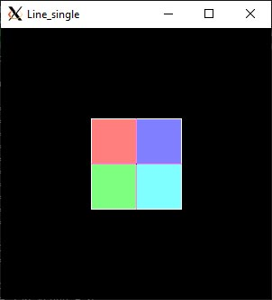

These are the final results of a graphics class. We were given a framework with empty functions and had to create fill them out.

My code can be found in rd_direct.cpp, with the rd_direct.h having functions we did not get to in class commented out. I also mad globals.cpp and globals.h to handle the helper functions I needed.

Using a vector of the struct color (found in color.h) the program can create images based on text file inputs.
______________________________________________________________________________________________________________________________________
Text File Format

Display - this line told the program where it wanted to put the image. Most of the time we sent it to the screen ("Screen") so we could see, though we were able to send to file.

Format - this was the X and Y size of the image in pixels. The program used this to initialize the vector. These is a Z plane, for depth, but the program auto created the depth.

FrameBegin & WorldBegin/ FrameEnd & WorldEnd - this told the program to start creating an image. Though demonstrated near the end of the semester, and understood how to do, we never had any assignment that had more then one frame.

Color - this command sent the current color being used. To simplify the writing process, each of the RGB values was inputted as a scale from 0 - 1 insted of 0 - 255.

Line - this created a line from one point in XYZ space to another. 

Circle - this command created a circle whose center was the given point in XYZ space and which had a radius given with the final value.

Fill - this caused the given collor to start filling a shape at the given cordinates. It used a recursive left-right, and up-down traversal to go to each pixel at a given depth that was the same color as the original pixel it was given. It would fill in pizels until it found a pixel of a different color.
_________________________________________________________________________________________________________________________________________
Images Made

**image1.txt:

  This is a pinwheel of different colored lines, visualy, going from the center of the images to the edges.

  

**image4.txt

  This one contains 2 sets of nested circles of different colors. The color pattern is reversed for each set of circles.
  
 

 
**image5.txt

  This is a series of crosed line of 2 diferent colors with the partitions they create filled in with different colors.
 

 **image6.txt

  The image created heare is a set of concentric circles with the spaces between each filled with a different color.
  
 

 **image7.txt

  This one also has a set of concentric circles filled as well. After which a set of lines bisect the circles, and the partitions around the edge are filled with different colors.
  
 
__________________________________________________________________________________________________________________________________________________________________________________

In order to view these images you will need an image program running in the background.

( THIS IS WHERE I PUT THE SETING FOR THAT ONE I FIGURE THAT OUT )
